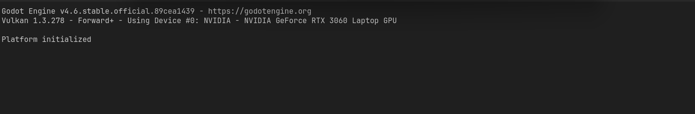
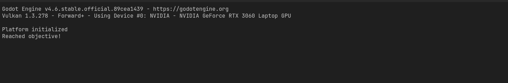
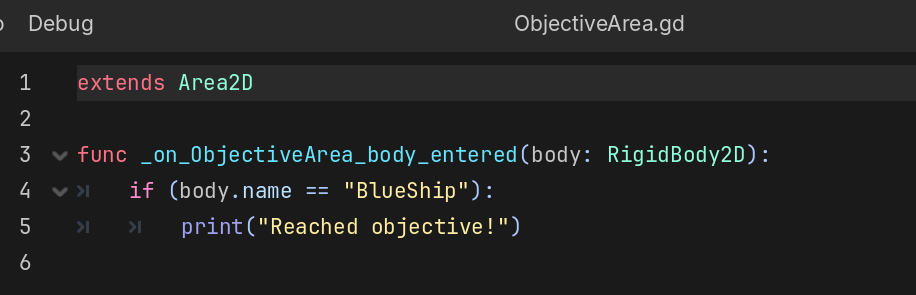
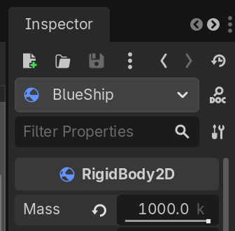
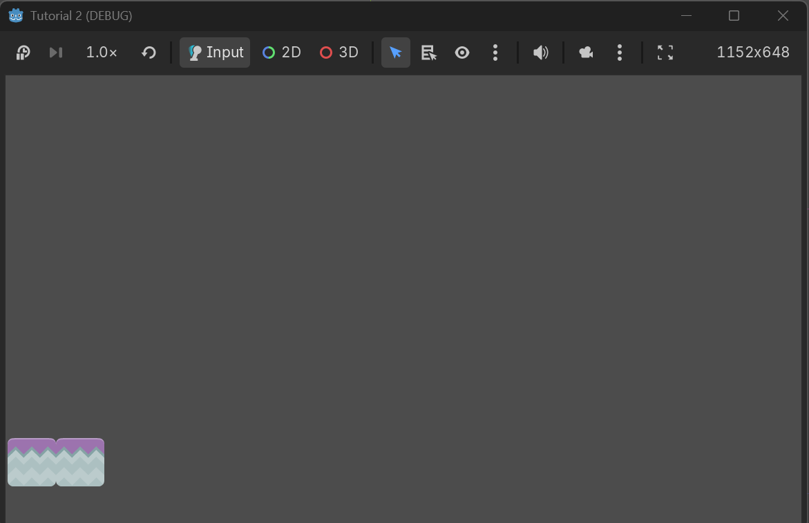
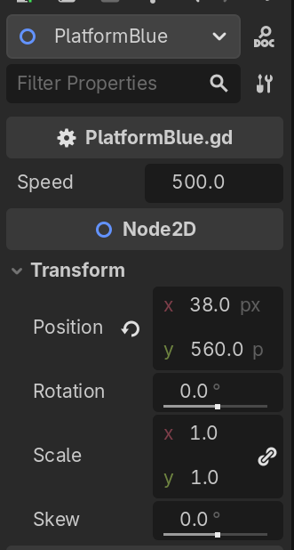
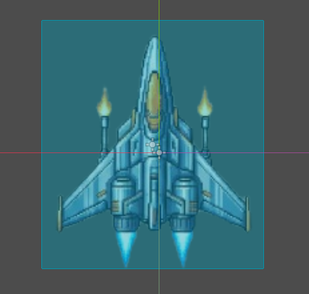
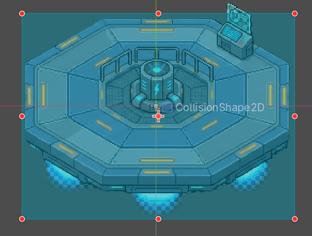

## NAMA    : Argya Farel Kasyara

## NPM     : 2306152424


## Latihan: Playtest
### 1. Apa saja pesan log yang dicetak pada panel Output?



Dari gambar diatas, tercantum informasi versi godot yang dipakai yaitu Godot Engine versi 4.6, lalu ada juga informasi renderer dan kartu grafis (GPU) yang dipakai dalam laptop saya dan yang terakhir ada status inisialisasi sistem "Platform initialized".

### 2. Coba gerakkan landasan ke batas area bawah, lalu gerakkan kembali ke atas hingga hampir menyentuh batas atas. Apa saja pesan log yang dicetak pada panel Output?



Sama seperti nomor sebelumnya namun terdapat pesan baru "Reached objective!" yang muncul ketika hampir menyentuh batas atas.

### 3. Buka scene MainLevel dengan tampilan workspace 2D. Apakah lokasi scene ObjectiveArea memiliki kaitan dengan pesan log yang dicetak pada panel Output pada percobaan sebelumnya?




Ya, lokasi scene ObjectiveArea di workspace 2D sangat berkaitan erat dengan pesan log yang dicetak.

Dari kode ObjectiveArea, kita dapat simpulkan bahwa ketika menggerakkan landasan (atau kapal "BlueShip" tersebut) ke atas dan menyentuh area di mana ObjectiveArea diletakkan, maka tepat pada titik koordinat persinggungan itulah Godot akan bereaksi dan mencetak log "Reached objective!". Jika letaknya berjauhan dan tidak saling menyentuh, pesannya tidak akan pernah muncul.

Kode menggunakan fungsi bawaan ```_on_ObjectiveArea_body_entered```. Ini adalah sebuah signal (sinyal) di Godot yang akan aktif secara otomatis hanya jika ada objek fisik lain yang masuk ke dalam area (CollisionShape2D) milik ObjectiveArea di dunia 2D. Lalu mengecek apakah nama objeknya BlueShip, jika iya maka pesan akan tercetak.

## Latihan: Memanipulasi Node dan Scene

### 1. Scene BlueShip dan StonePlatform sama-sama memiliki sebuah child node bertipe Sprite2D. Apa fungsi dari node bertipe Sprite2D?

Fungsi utama dari node bertipe Sprite2D di Godot Engine adalah untuk menampilkan gambar dua dimensi (tekstur) ke dalam layar

Ada 3 fungsi utama Sprite2D: memberikan wujud visual, menyimpan dan mengatur tekstur, manipulasi visual


### 2. Root node dari scene BlueShip dan StonePlatform menggunakan tipe yang berbeda. BlueShip menggunakan tipe RigidBody2D, sedangkan StonePlatform menggunakan tipe StaticBody2D. Apa perbedaan dari masing-masing tipe node?

**RigidBody2D** yang digunakan oleh BlueShip adalah benda yang dinamis dan sepenuhnya dikendalikan oleh mesin fisika (physics engine). Sifat utama dari benda ini adalah memiliki berat (massa), dipengaruhi oleh gravitasi, gesekan, dan gaya pantul.

Karena dipengaruhi oleh gravitasi maka, jika tidak menahannya dengan kode atau benda lain, ia akan jatuh ke bawah karena gravitasi. Jika ditabrak benda lain, ia akan terpental atau terdorong.

Kenapa BlueShip pakai ini? Karena agar kapal bisa "didorong" oleh StonePlatform ke atas agar mengenai ObjectiveArea.

**StaticBody2D** yang digunakan oleh StonePlatform adalah benda yang statis atau diam. Benda ini tidak dipengaruhi oleh gravitasi atau gaya fisik lainnya. Ia dianggap memiliki massa tak terhingga.Ia tidak akan bergerak, tidak peduli seberapa keras benda lain menabraknya. 

Kenapa StonePlatform pakai ini? Karena agar StonePlatform tidak jatoh saat mendorong BlueShip ke atas.

### 3. Ubah nilai atribut Mass pada tipe RigidBody2D secara bebas di scene BlueShip, lalu coba jalankan scene MainLevel. Apa yang terjadi?



Saya coba set menjadi 1000 kg. Tidak ada perbedan yang bisa saya lihat. Karena tidak ada air fraction, maka kedua kapal turun dengan kecepatan yang sama. Lalu karena platform mendorong dengan kecepatan konstan dan tidak memperdulikan berat. Maka naiknya kapal juga sama.

### 4. Ubah nilai atribut Disabled milik node CollisionShape2D pada scene StonePlatform, lalu coba jalankan scene MainLevel. Apa yang terjadi?



Kapal akan nembus StonePlatform dan jatuh ke bawah karena StonePlatform tidak memiliki collision.

### 5. Pada scene MainLevel, coba manipulasi atribut Position, Rotation, dan Scale milik node BlueShip secara bebas. Apa yang terjadi pada visualisasi BlueShip di Viewport?


Terlihat bahwa visualisasi BlueShip di Viewport juga akan berubah.

### 6. Pada scene MainLevel, perhatikan nilai atribut Position node PlatformBlue, StonePlatform, dan StonePlatform2. Mengapa nilai Position node StonePlatform dan StonePlatform2 tidak sesuai dengan posisinya di dalam scene (menurut Inspector) namun visualisasinya berada di posisi yang tepat?

Hal ini terjadi karena konsep "Koordinat Lokal" (Local Coordinates) vs "Koordinat Global" (Global Coordinates) dalam sistem hierarki Godot (Parent-Child). Nilai Position yang  dilihat di panel Inspector selalu bersifat RELATIF terhadap Parent (Induk)-nya, bukan terhadap dunia (World/Global).

Tinjau pada gambar, Position untuk PlatformBlue sudah sesuai relatif dengan MainLevel dan karena StonePlatform merupakan child dari node tersebut maka positionnya mengikuti PlatformBlue.



## Latihan Mandiri: Membuat Level Baru


### Objek pesawat baru (NewShip.tscn)



### Objek landasan baru (NewPlatform.tscn)



### Desain level yang berbeda dari level awal dengan menempatkan ObjectiveArea di pojok kanan atas atau pojok kanan bawah area permainan di level baru (NewLevel.tscn).

